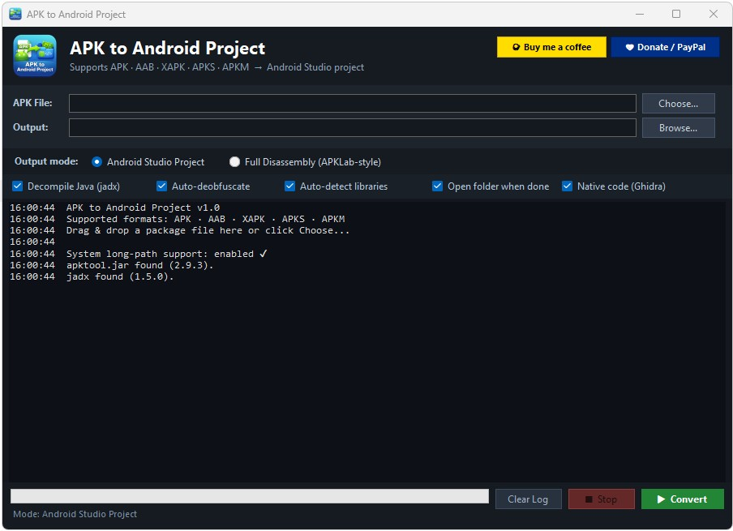

  

  # APK to Android Project

  **Turn an APK, AAB, XAPK, APKS or APKM into a ready-to-open Android Studio project —
  or a complete APKLab-style disassembly — without leaving Windows.**

  
  
  
  

  

---

## 📥 Download & install

1. Download the latest installer from the **[Releases](../../releases/latest)** page:
   `ApkToAndroidProject-<version>-Setup.exe`.
2. Run it and follow the setup wizard (installs to `Program Files`, requires administrator
   rights, 64-bit Windows only).
3. Launch **APK to Android Project** from the Start Menu or the desktop shortcut (optional,
   offered during setup).

That's it — no need to install Android Studio, the Android SDK, Java tooling manually, or
anything else beforehand.

> The installer only ships the app itself. The first time you actually convert a package, the
> app downloads the small set of open-source engines it needs (`apktool`, `jadx`, `bundletool`,
> and — only if you opt in — Ghidra for native code analysis) straight from their official
> sources into a `tools\` folder next to the app. This keeps the installer small and makes sure
> you always get the exact pinned versions the app was built and tested against.

### Requirements

- **Windows Vista, 7, 8, 8.1, 10 or 11** (64-bit).
- **Java (JRE or JDK)** installed — used internally by `apktool`, `jadx` and `bundletool`. It's
  detected automatically (`JAVA_HOME`, common install paths, or `PATH`).
- An internet connection **the first time** each feature is used, to download the tools above.

---

## ✨ What it does

Pick an Android package and the app takes care of the rest:

1. **Detects and extracts** the real format of the file (APK, AAB, XAPK, APKS or APKM) — even
   if the extension doesn't match, by inspecting the archive contents.
2. **Decompiles** the bytecode with `apktool`, and optionally the Java/Kotlin source with `jadx`.
3. Depending on the **mode you choose**, it produces:
   - a ready-to-open **Android Studio project** (Gradle) with detected libraries already declared, or
   - a **complete APKLab-style disassembly** (apktool tree + jadx sources + binary XML decoded
     to readable text), with nothing restructured into Gradle.
4. Generates **info and security reports**, and can optionally **decompile native code** (`.so`
   libraries) with Ghidra.

Everything runs locally through a simple desktop UI: pick a file → pick a mode → Convert.

---

## 📦 Supported formats

| Format | How it's handled |
|---|---|
| **APK** | Used directly |
| **AAB** (Android App Bundle) | Converted to a universal APK with `bundletool` |
| **XAPK** (APKPure) | Extracts the base APK + config splits + OBB expansion files |
| **APKS** (bundletool) | Extracts the base APK from the split archive |
| **APKM** (APK Mirror) | Extracts the base APK + configuration splits |

---

## 🧭 How to use it

1. Open **APK to Android Project**.
2. Pick your package with **Choose…**, or drag & drop it onto the window. As soon as it loads,
   an information window pops up automatically (package name, version, SDK levels, permissions,
   app icon, signing certificate, hashes…) without blocking the rest of the app.
3. Pick the **output mode**:
   - **Android Studio Project** — to inspect or edit the code inside Android Studio.
   - **Full Disassembly (APKLab-style)** — for the full raw disassembly exactly as `apktool`
     produces it, plus `jadx` sources and binary XML already decoded to text.
4. Adjust the checkboxes if needed (decompile Java, auto-deobfuscate, detect libraries, analyze
   native code with Ghidra, open the output folder when done).
5. Click **Convert**. The log at the bottom shows every step in real time, and you can cancel
   at any point with **Stop**.

When it's done, you'll find two Markdown reports next to the generated project or disassembly:
**`APK_INFO.md`** (identity, hashes, ABIs, permissions, components…) and **`SECURITY_REPORT.md`**
(dangerous permissions and suspicious API patterns, with a risk score).

---

## 🗂️ The two output modes

### Android Studio Project

Generates a full Gradle layout: `build.gradle` (root and app module), `settings.gradle`,
`gradle.properties`, the Gradle wrapper, `google-services.json` (if the app uses Firebase),
ProGuard rules, and the code/resources already organized under `src/main/`. Detected libraries
are added as dependencies with their real versions whenever possible (read straight from the
APK's own metadata), and a number of automatic fixes are applied so the project gets as close
as possible to actually building in Android Studio.

> A decompiled APK doesn't always recompile 1:1 — the decompiler's output can clash with the
> very libraries being re-declared. This mode is meant mainly for **inspecting, browsing and
> editing** the project in Android Studio, not as a guaranteed rebuild.

### Full Disassembly (APKLab-style)

Leaves the `apktool` output tree untouched (smali, resources, manifest, `apktool.yml`), adds the
`jadx` sources under `java-src/`, keeps the original package and every extracted artifact (base
APK, splits, OBB files) under `package/`, and **decodes any binary XML to readable text** — both
what's left in the tree and what's inside the APK archives themselves — into `decoded/`. Ideal
for analysis or reverse engineering with no intention of rebuilding.

---

## 🔍 What else it includes

- **Instant info panel** when you load any package: name, version, min/target SDK, permissions,
  components, app icon, and signing certificate details (both classic and modern v2/v3 signature
  schemes) — all read directly from the package without relying on the Android SDK's own tools.
- **Security report** covering dangerous permissions and suspicious API combinations (sending
  location via SMS, dynamic code loading, command execution, and more), with an indicative risk
  score.
- **Optional native code analysis**: decompiles `.so` libraries with Ghidra in headless mode and
  produces readable pseudo-C code per library.
- Quick-access buttons to Google Play, APKPure and VirusTotal for the inspected package, plus
  direct installation via ADB when available.

---

## 🧑‍💻 Building from source

This repository only hosts the installer and release binaries for end users. The source code,
build instructions and internal documentation live in the main development repository:

**[github.com/mananpa4/Apk-to-Android-Project](https://github.com/mananpa4/Apk-to-Android-Project)**

---

## 🙏 Credits

This project relies on — and takes inspiration from — several open-source projects:

- [apktool](https://github.com/iBotPeaches/Apktool) and [jadx](https://github.com/skylot/jadx) —
  the decompilation engine.
- [bundletool](https://github.com/google/bundletool) — App Bundle conversion.
- [Ghidra](https://github.com/NationalSecurityAgency/ghidra) — native code analysis.
- [APK-Info](https://github.com/Enyby/APK-Info) — inspiration for the info panel.
- [quark-engine](https://github.com/quark-engine/quark-engine) — inspiration for the suspicious
  pattern analysis.
- [APKLab](https://github.com/APKLab/APKLab) — inspiration for the full disassembly mode.
- [BetterKnownInstalled](https://github.com/backslashxx/BetterKnownInstalled) — inspiration for
  decoding binary XML to readable text.

---

## 💛 Support the project

If you find it useful and want to buy me a coffee:

---

## ⚠️ Notice

This tool is meant for legitimate use: analysis, learning, migrating your own apps, or security
auditing of applications you're authorized to work on. Respect the licenses and terms of use of
any software you decompile.
